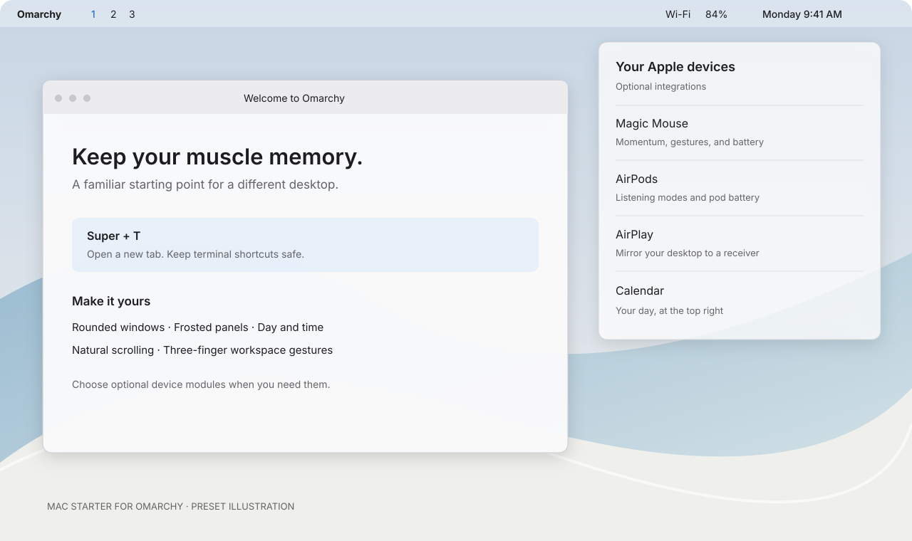

# Mac starter for Omarchy

Give Omarchy a familiar feel with Mac-style shortcuts, rounded windows, frosted panels, a transparent top bar, and the day and time on the right. Add the Apple-device plugins you want during installation.



*Preset illustration. This project is independent of Apple and Omarchy.*

## Install

On an existing **Omarchy 4 desktop**, open a terminal and paste:

```bash
git clone https://github.com/johnloringpollard/omarchy-mac-starter.git && cd omarchy-mac-starter && ./setup
```

Choose any optional plugins, then confirm installation. The installer applies the desktop and shortcuts, installs the selected plugins and their dependencies, and activates the theme. Package or hardware installers may ask for your administrator password.

| Optional plugin | Adds |
| --- | --- |
| Magic Mouse | Scrolling, momentum, gestures, and battery display, including the local mouse fixes. |
| AirPods | Battery and listening-mode controls, with the matching LibrePods backend. |
| AirPlay | Desktop mirroring through DoubleTake, with the stream timeout fix. |
| Magic Keyboard/Trackpad | Device controls through OMagic. |
| Calendar | OmaCal, ready to configure and enable when you want to replace the clock. |
| Messages | Blip, ready to connect to your own Mac. |
| Activity Monitor | CPU, memory, storage, and process information. |

Then configure your plugins however you like. Pair devices, connect accounts, and change preferences through their panels or [upstream setup guides](docs/devices.md). The starter handles installation; it does not configure your accounts, pair devices, or set up an iMessage bridge for you.

Already-installed plugins are left alone. Existing custom widgets are preserved, and the installer reuses your clock. Run `./setup` again to add more plugins.

## Preview or automate

```bash
./setup --dry-run
./setup --yes --plugins magic-mouse airpods airplay
```

The first command previews without making changes. The second skips the selection prompts; system package tools may still require interaction.

For the core desktop only, use `./setup --yes`. The lower-level `install`, `plugins`, and `doctor` commands remain available for [advanced use](docs/architecture.md).

## Compatibility and removal

The source setup runs Omarchy 4.0.4, Lua-based Hyprland 0.56.2, and Quickshell 0.3.1. Python 3.11 or newer and Git are required. Other distributions and older Hyprland configurations are unsupported. Physical device compatibility varies; see [verification](docs/verification.md).

If you used the earlier local Apple theme, read [migration notes](docs/migration.md) first.

To remove the desktop preset, remove plugins that use its shared shadows first, select another theme in Omarchy, and run `./uninstall --apply`. It restores installer-owned settings and stops if doing so would overwrite later edits. Optional device backends have [separate removal steps](docs/devices.md#removal).

The [inventory](docs/inventory.md) records the wider source setup. This repository ships no pairing keys, account sessions, messages, Notes, or saved device addresses. See [credits and licenses](THIRD_PARTY.md) for the included assets and upstream projects.
